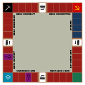

# communopoly
Gra inspirowana Monopoly lub Eurobusiness z motywem komunistycznym

Wynik nie kompletnie losowy, jakiś element skilla

Może jakieś dodatkowe tryby typu mgła, podkładanie przeszkód za pieniążki typu Mario Bros, wyścigi na okrążenie pól

Gracz rozpoczyna ze stałą liczbą waluty ("kartek"), a wygrywa osoba która jako ostatnia wszystkie je straci..

Na planszy będą 3 specjalne pola ,  jednym z nich będzie "Zsyłka na Syberię", będzie to obszar który będzie się pojawiać na każdej mapie.
Gdy wejdziemy na to pole zostaniemy automatycznie przeniesieni na Syberię, czas przeniesienia to 3 tury.
Gracz może uniknąć przeniesienia pod warunkiem, że wylosował szóstkę bądź posiada Kartę partii Pracy. Znakiem rozpoznawczym tego pola będzie

Kolejnym specjalnym polem jest some emphasized markdown text "Redystrybucja majątku" jeśli któryś z graczy wejdzię na to pole to automatycznie gracz z największą ilością punktów przekazuje x% swoich punktów osobię z najmniejszą ilością punktów.

Ostatnie pole specjalne to "Przymuszona reedukacja" gracz może opuścić to polę za zapłatą x% swoich punktów bądź zostać tam na 3 tury podczas których będą wpajane mu idee komunizmu

Poza specjalnymi polami gracze będą przemieszczać się po terenach krajów należących do Związeku Radzieckiego.